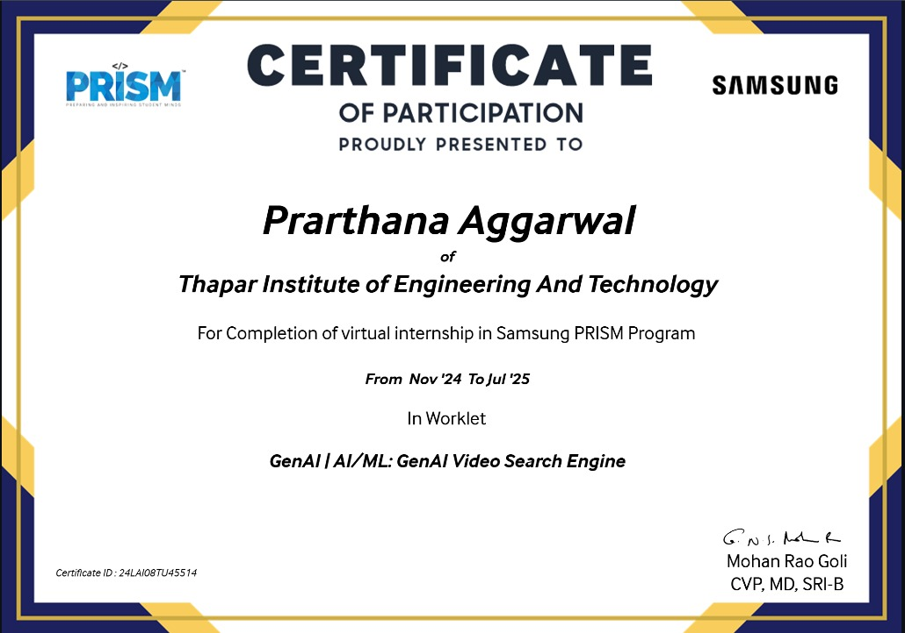
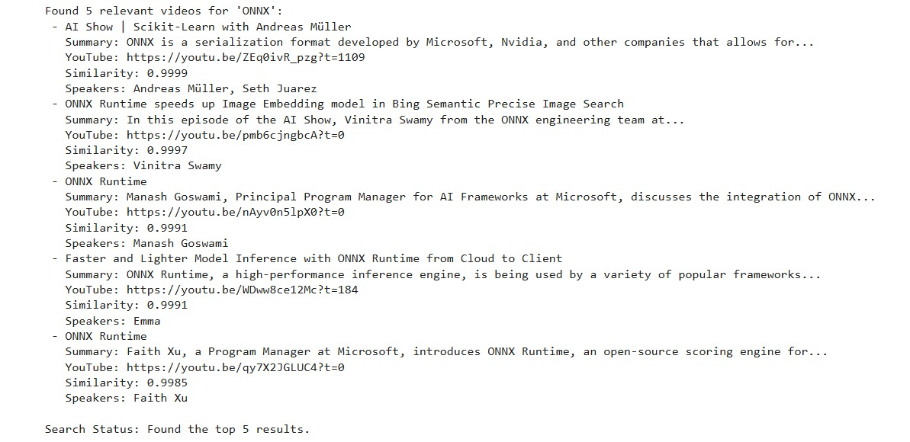
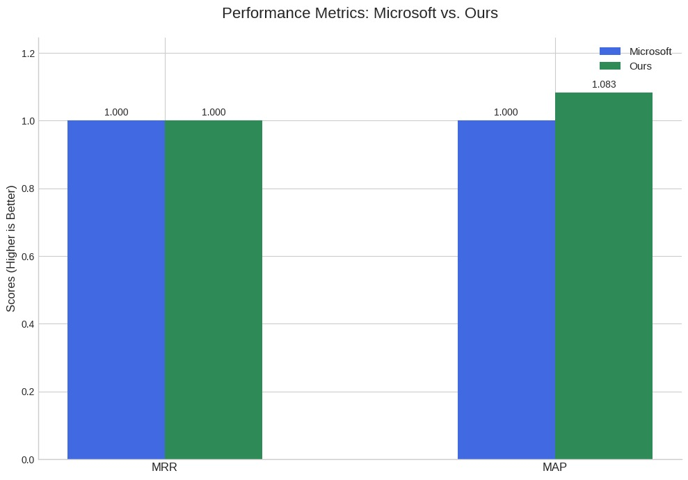

# 🎥 GenAI Video Semantic Search

Selected in the Samsung PRISM Program, developed under the guidance of Thapar Institute of Engineering and Technology faculty and Samsung mentors, with a research paper on this work currently in progress.


A lightweight semantic search engine for AI-focused YouTube transcripts. Ask in natural language and get the most relevant transcript snippets instantly.


*Sample search result for “reinforcement learning”*

---

## 🔑 Key Features

* **Semantic Search:** Leverages sentence embeddings for meaning-based retrieval.
* **Chunking:** Splits transcripts into \~100‑word pieces to fit transformer limits.
* **Fast & Accurate:** Uses `all-MiniLM-L6-v2` for 384‑dim embeddings.
* **Comparison:** Outperforms default Microsoft model in relevance (see below).


*Our search vs. Microsoft model*

---

## 🚀 Quick Start

1. **Clone & Install**

   ```bash
   git clone https://github.com/yourname/genai-video-search.git
   cd genai-video-search
   pip install -r requirements.txt
   ```

2. **Download Data**

   * Place your `kaggle.json` (Kaggle API token) in the project root.
   * Run:

     ```bash
     kaggle datasets download -d jfcaro/5000-transcripts-of-youtube-ai-related-videos --unzip
     ```

3. **Run Search**

   ```bash
   python main.py --query "Machine Learning" --top_k 5
   ```

---

## 🛠️ Tech Stack

* **Python 3.8+**
* **Pandas** for data handling
* **PyTorch** & **SentenceTransformers** for embeddings
* **Kaggle CLI** for dataset download

---

## ⚙️ How It Works

1. **Load** the transcripts CSV.
2. **Chunk** long texts into \~100‑word segments.
3. **Embed** chunks with `all-MiniLM-L6-v2`.
4. **Search** by encoding your query and ranking with cosine similarity.

---

## 🔄 Extend & Improve

* Plug in a **vector DB** (FAISS, Weaviate) for large-scale indexing.
* Add **cross-encoder** re‑ranking for finer precision.
* Wrap in a **Streamlit** or **Flask** UI for interactive demos.

---

## 📬 Contact

Made by **Prarthana Aggarwal**
✉️ [imp.prarthana.imp@gmail.com](mailto:imp.prarthana.imp@gmail.com) | 📂 [GitHub](https://github.com/prarthana-145)
